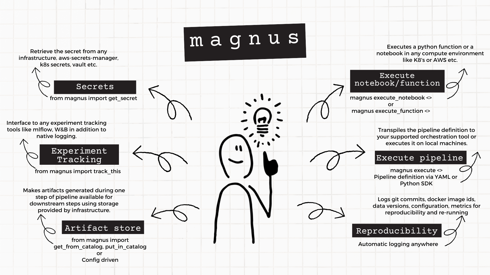

# Hello from magnus


<p align="center">
  
</p>
---

<p align="center">
<a href="https://pypi.org/project/magnus/"></a>
<a href="https://pypi.org/project/magnus/"></a>
<a href="https://github.com/AstraZeneca/magnus-core/blob/main/LICENSE"></a>
<a href="https://github.com/psf/black"></a>
<a href="https://github.com/python/mypy"></a>
<a href="https://github.com/AstraZeneca/magnus-core/actions/workflows/release.yaml">
<a href="https://github.com/AstraZeneca/magnus-core/actions/workflows/docs.yaml">
</p>
---

Magnus is a simplified workflow definition language that helps in:

- **Streamlined Design Process:** Magnus enables users to efficiently plan their pipelines with
[stubbed nodes](https://astrazeneca.github.io/magnus-core/concepts/stub), along with offering support for various structures such as
[tasks](https://astrazeneca.github.io/magnus-core/concepts/task), [parallel branches](https://astrazeneca.github.io/magnus-core/concepts/parallel), and [loops or map branches](https://astrazeneca.github.io/magnus-core/concepts/map)
in both [yaml](https://astrazeneca.github.io/magnus-core/concepts/pipeline) or a [python SDK](https://astrazeneca.github.io/magnus-core/sdk) for maximum flexibility.

- **Incremental Development:** Build your pipeline piece by piece with Magnus, which allows for the
implementation of tasks as [python functions](https://astrazeneca.github.io/magnus-core/concepts/task/#python_functions),
[notebooks](https://astrazeneca.github.io/magnus-core/concepts/task/#notebooks), or [shell scripts](https://astrazeneca.github.io/magnus-core/concepts/task/#shell),
adapting to the developer's preferred tools and methods.

- **Robust Testing:** Ensure your pipeline performs as expected with the ability to test using sampled data. Magnus
also provides the capability to [mock and patch tasks](https://astrazeneca.github.io/magnus-core/configurations/executors/mocked)
for thorough evaluation before full-scale deployment.

- **Seamless Deployment:** Transition from the development stage to production with ease.
Magnus simplifies the process by requiring [only configuration changes](https://astrazeneca.github.io/magnus-core/configurations/overview)
to adapt to different environments, including support for [argo workflows](https://astrazeneca.github.io/magnus-core/configurations/executors/argo).

- **Efficient Debugging:** Quickly identify and resolve issues in pipeline execution with Magnus's local
debugging features. Retrieve data from failed tasks and [retry failures](https://astrazeneca.github.io/magnus-core/concepts/run-log/#retrying_failures)
using your chosen debugging tools to maintain a smooth development experience.

Along with the developer friendly features, magnus also acts as an interface to production grade concepts
such as [data catalog](https://astrazeneca.github.io/magnus-core/concepts/catalog), [reproducibility](https://astrazeneca.github.io/magnus-core/concepts/run-log),
[experiment tracking](https://astrazeneca.github.io/magnus-core/concepts/experiment-tracking)
and secure [access to secrets](https://astrazeneca.github.io/magnus-core/concepts/secrets).


## What does it do?





## Documentation

[More details about the project and how to use it available here](https://astrazeneca.github.io/magnus-core/).


## Installation

The minimum python version that magnus supports is 3.8

```shell
pip install magnus
```

Please look at the [installation guide](https://astrazeneca.github.io/magnus-core/usage)
for more information.


## Example

Your application code. Use pydantic models as DTO.

Assumed to be present at ```functions.py```
```python
from pydantic import BaseModel

class InnerModel(BaseModel):
    """
    A pydantic model representing a group of related parameters.
    """

    foo: int
    bar: str


class Parameter(BaseModel):
    """
    A pydantic model representing the parameters of the whole pipeline.
    """

    x: int
    y: InnerModel


def return_parameter() -> Parameter:
    """
    The annotation of the return type of the function is not mandatory
    but it is a good practice.

    Returns:
        Parameter: The parameters that should be used in downstream steps.
    """
    # Return type of a function should be a pydantic model
    return Parameter(x=1, y=InnerModel(foo=10, bar="hello world"))


def display_parameter(x: int, y: InnerModel):
    """
    Annotating the arguments of the function is important for
    magnus to understand the type of parameters you want.

    Input args can be a pydantic model or the individual attributes.
    """
    print(x)
    # >>> prints 1
    print(y)
    # >>> prints InnerModel(foo=10, bar="hello world")
```

### Application code using driver functions.

The code is runnable without any orchestration framework.

```python
from functions import return_parameter, display_parameter

my_param = return_parameter()
display_parameter(my_param.x, my_param.y)
```

### Orchestration using magnus

<table>
<tr>
    <th>python SDK</th>
    <th>yaml</th>
</tr>
<tr>
<td valign="top"><p>

Example present at: ```examples/python-tasks.py```

Run it as: ```python examples/python-tasks.py```

```python
from magnus import Pipeline, Task

def main():
    step1 = Task(
        name="step1",
        command="examples.functions.return_parameter",
    )
    step2 = Task(
        name="step2",
        command="examples.functions.display_parameter",
        terminate_with_success=True,
    )

    step1 >> step2

    pipeline = Pipeline(
        start_at=step1,
        steps=[step1, step2],
        add_terminal_nodes=True,
    )

    pipeline.execute()


if __name__ == "__main__":
    main()
```

</p></td>

<td valign="top"><p>

Example present at: ```examples/python-tasks.yaml```


Execute via the cli: ```magnus execute -f examples/python-tasks.yaml```

```yaml
dag:
  description: |
    This is a simple pipeline that does 3 steps in sequence.
    In this example:
      1. First step: returns a "parameter" x as a Pydantic model
      2. Second step: Consumes that parameter and prints it

    This pipeline demonstrates one way to pass small data from one step to another.

  start_at: step 1
  steps:
    step 1:
      type: task
      command_type: python # (2)
      command: examples.functions.return_parameter # (1)
      next: step 2
    step 2:
      type: task
      command_type: python
      command: examples.functions.display_parameter
      next: success
    success:
      type: success
    fail:
      type: fail
```

</p></td>

</tr>
</table>

### Transpile to argo workflows

No code change, just change the configuration.

```yaml
executor:
  type: "argo"
  config:
    image: magnus:demo
    persistent_volumes:
      - name: magnus-volume
        mount_path: /mnt

run_log_store:
  type: file-system
  config:
    log_folder: /mnt/run_log_store
```

More details can be found in [argo configuration](https://astrazeneca.github.io/magnus-core/configurations/executors/argo).

Execute the code as ```magnus execute -f examples/python-tasks.yaml -c examples/configs/argo-config.yam```

<details>
  <summary>Expand</summary>

```yaml
apiVersion: argoproj.io/v1alpha1
kind: Workflow
metadata:
  generateName: magnus-dag-
  annotations: {}
  labels: {}
spec:
  activeDeadlineSeconds: 172800
  entrypoint: magnus-dag
  podGC:
    strategy: OnPodCompletion
  retryStrategy:
    limit: '0'
    retryPolicy: Always
    backoff:
      duration: '120'
      factor: 2
      maxDuration: '3600'
  serviceAccountName: default-editor
  templates:
    - name: magnus-dag
      failFast: true
      dag:
        tasks:
          - name: step-1-task-uvdp7h
            template: step-1-task-uvdp7h
            depends: ''
          - name: step-2-task-772vg3
            template: step-2-task-772vg3
            depends: step-1-task-uvdp7h.Succeeded
          - name: success-success-igzq2e
            template: success-success-igzq2e
            depends: step-2-task-772vg3.Succeeded
    - name: step-1-task-uvdp7h
      container:
        image: magnus:demo
        command:
          - magnus
          - execute_single_node
          - '{{workflow.parameters.run_id}}'
          - step%1
          - --log-level
          - WARNING
          - --file
          - examples/python-tasks.yaml
          - --config-file
          - examples/configs/argo-config.yaml
        volumeMounts:
          - name: executor-0
            mountPath: /mnt
        imagePullPolicy: ''
        resources:
          limits:
            memory: 1Gi
            cpu: 250m
          requests:
            memory: 1Gi
            cpu: 250m
    - name: step-2-task-772vg3
      container:
        image: magnus:demo
        command:
          - magnus
          - execute_single_node
          - '{{workflow.parameters.run_id}}'
          - step%2
          - --log-level
          - WARNING
          - --file
          - examples/python-tasks.yaml
          - --config-file
          - examples/configs/argo-config.yaml
        volumeMounts:
          - name: executor-0
            mountPath: /mnt
        imagePullPolicy: ''
        resources:
          limits:
            memory: 1Gi
            cpu: 250m
          requests:
            memory: 1Gi
            cpu: 250m
    - name: success-success-igzq2e
      container:
        image: magnus:demo
        command:
          - magnus
          - execute_single_node
          - '{{workflow.parameters.run_id}}'
          - success
          - --log-level
          - WARNING
          - --file
          - examples/python-tasks.yaml
          - --config-file
          - examples/configs/argo-config.yaml
        volumeMounts:
          - name: executor-0
            mountPath: /mnt
        imagePullPolicy: ''
        resources:
          limits:
            memory: 1Gi
            cpu: 250m
          requests:
            memory: 1Gi
            cpu: 250m
  templateDefaults:
    activeDeadlineSeconds: 7200
    timeout: 10800s
  arguments:
    parameters:
      - name: run_id
        value: '{{workflow.uid}}'
  volumes:
    - name: executor-0
      persistentVolumeClaim:
        claimName: magnus-volume

```

</details>

## Pipelines can be:

### Linear

A simple linear pipeline with tasks either
[python functions](https://astrazeneca.github.io/magnus-core/concepts/task/#python_functions),
[notebooks](https://astrazeneca.github.io/magnus-core/concepts/task/#notebooks), or [shell scripts](https://astrazeneca.github.io/magnus-core/concepts/task/#shell)

[](https://mermaid.live/edit#pako:eNpl0bFuwyAQBuBXQVdZTqTESpxMDJ0ytkszhgwnOCcoNo4OaFVZfvcSx20tGSQ4fn0wHB3o1hBIyLJOWGeDFJ3Iq7r90lfkkA9HHfmTUpnX1hFyLvrHzDLl_qB4-1BOOZGGD3TfSikvTDSNFqdj2sT2vBTr9euQlXNWjqycsN2c7UZWFMUE7udwP0L3y6JenNKiyfvz8t8_b-gavT9QJYY0PcDtjeTLptrAChriBq1JzeoeWkG4UkMKZCoN8k2Bcn1yGEN7_HYaZOBIK4h3g4EOFi-MDcgKa59SMja0_P7s_vAJ_Q_YOH6o)

### [Parallel branches](https://astrazeneca.github.io/magnus-core/concepts/parallel)

Execute branches in parallel

[](https://mermaid.live/edit#pako:eNp9k01rwzAMhv-K8S4ZtJCzDzuMLmWwwkh2KMQ7eImShiZ2sB1KKf3vs52PpsWNT7LySHqlyBeciRwwwUUtTtmBSY2-YsopR8MpQUfAdCdBBekWNBpvv6-EkFICzGAtWcUTDW3wYy20M7lr5QGBK2j-anBAkH4M1z6grnjpy17xAiTwDII07jj6HK8-VnVZBspITnpjztyoVkLLJOy3Qfrdm6gQEu2370Io7WLORo84PbRoA_oOl9BBg4UHbHR58UkMWq_fxjrOnhLRx1nH0SgkjlBjh7ekxNKGc0NelDLknhePI8qf7MVNr_31nm1wwNTeM2Ao6pmf-3y3Mp7WlqA7twOnXfKs17zt-6azmim1gQL1A0NKS3EE8hKZE4Yezm3chIVFiFe4AdmwKjdv7mIjKNYHaIBiYsycySPFlF8NxzotkjPPMNGygxXu2pxp2FSslKzBpGC1Ml7IKy3krn_E7i1f_wEayTcn)

### [loops or map](https://astrazeneca.github.io/magnus-core/concepts/map)

Execute a pipeline over an iterable parameter.

[](https://mermaid.live/edit#pako:eNqVlF1rwjAUhv9KyG4qKNR-3ATczWRXG4x5aUWy5tQW20SSdE7E_76kUalWsE1uQs77njwkJ-eIU8EAE5yVYp_mVGr08Z3wNK_5tsgO3vLNrlBWlKBWI0LIRgLwhKs6TUEpb7lwi3bMRn82ku5yJDgsv6SwCtRkWiUcmbFze-vmnKl3p7G5DlAaIqc-H3ZVt8-86B7lRZPJ65054cDZDaLei-eIwSDEoDdi0EUMHiDm5mKfQ4aDIMPekGEXMuxCZqKWzxmjQYxRb8aoyxg9YCx-e9xjPIgx7s0YdxnjK6Odl19ndMhTWhYMZlN_jJQ2_3JdcAZ_M39kk5h_1U7Wzzp1XlPww73B2Wsrcbg7dG5bIsPN0dls3u7WbOwlVWoOGXK3bmxSbIG8vJvh-61405muYT_z3fPgMa5AVrRgpgMe7V6CdQ4VJJiYJaNym-CEn4yO1losDjzFRMsaxrjeMaphXlBTWRUmGS2V2QVWaCE_XUttOuvpH6aD41c)
