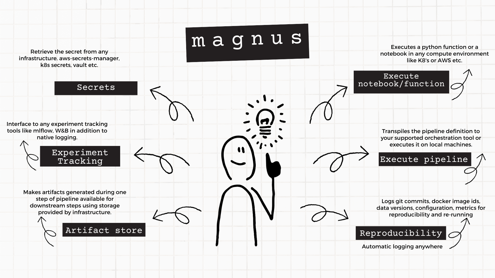

<figure markdown>
  { width="400" height="300"}
  <figcaption></figcaption>
</figure>

---

Successful data science projects require a varied set of skills from data scientists, ML engineers, and infrastructure
teams. Often, the roles and responsibilities of these personas are blurred leading to projects that are difficult to
maintain, test, reproduce or run at scale.

We build __**Magnus**__ to separate those concerns and create a clear boundary of the personas.

## Design principles

- [x] Code should not be mixed with implementation details of underlying platform.

**Example**: Data and parameters are often shared between different steps of the pipeline.
The platform implementation should not add additional code to make this happen.

- [x] Interactive development/debugging should be a first-class citizen.

**Example**: Data science teams thrive in environments with quick debug loop. Able to use their preferred tools
and iterate without constraints of the platform aids development/debugging.

- [x] Align the best practices even during development phase.

**Example**: All projects require secrets to access secure content. The concept of secret should be
available even during development phase and there should be no change in code when it is run in production set up.

## What does it do?

Magnus is a thin abstraction layer over the services typically provided by production grade infrastructures. Independent
of the provider, it exposes a consistent interface to those services, **this holds true even for the local environment**.

<figure markdown>
  { width="1200" height="800"}
  <figcaption></figcaption>
</figure>

The scope of magnus is intentionally limited to aid during the model development phase.
It does not boast of end to end development. The heavy lifting is always done by the providers.
